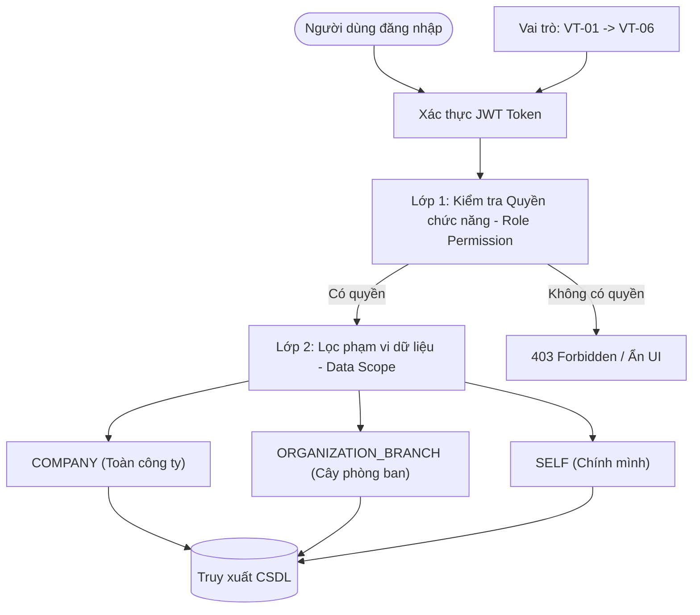

# Hướng Dẫn Chuẩn Hóa Phân Quyền & Vai Trò Hệ Thống (RBAC & User Roles Specification)

> **Tài liệu chuẩn hóa chính thức dành cho toàn bộ đội ngũ phát triển (Frontend, Backend, Tester & BA).**  
> Căn cứ đối chiếu: Tài liệu Kế hoạch nguồn lực (`docs/plans/De_tai_2_Ke_Hoach_Nguon_Luc.xlsx`), 14 Epics (`NCL-01` $\rightarrow$ `NCL-14`), 84 User Stories, 24 Quy tắc nghiệp vụ (`QTN-01` $\rightarrow$ `QTN-24`) và mã nguồn thực tế của hệ thống.

---

## MỤC LỤC

1. [Tổng quan & Bản chất kiến trúc Phân quyền (Core Architecture)](#1-tổng-quan--bản-chất-kiến-trúc-phân-quyền)
2. [Chi tiết 6 Vai trò Nghiệp vụ Chính thức & Phạm vi công việc](#2-chi-tiết-6-vai-trò-nghiệp-vụ-chính-thức--phạm-vi-công-việc)
   - [VT-01 · Ban giám đốc (Executive / Director)](#vt-01--ban-giám-đốc-executive--director)
   - [VT-02 · Quản lý dự án (Project Manager - PM)](#vt-02--quản-lý-dự-án-project-manager---pm)
   - [VT-03 · Quản lý nguồn lực (Resource Manager - RM)](#vt-03--quản-lý-nguồn-lực-resource-manager---rm)
   - [VT-04 · Nhân viên chuyên môn (Specialist / Employee)](#vt-04--nhân-viên-chuyên-môn-specialist--employee)
   - [VT-05 · Nhân sự (HR Specialist / Manager)](#vt-05--nhân-sự-hr-specialist--manager)
   - [VT-06 · Quản trị viên (System Administrator)](#vt-06--quản-trị-viên-system-administrator)
3. [Lưu ý đặc biệt về "VT-07 / Nhân viên công ty" & Chức năng dùng chung](#3-lưu-ý-đặc-biệt-về-vt-07--nhân-viên-công-ty--tiện-ích-dùng-chung)
4. [Ma trận Phân quyền 14 Epics & Màn hình Chức năng (Functional Matrix)](#4-ma-trận-phân-quyền-14-epics--màn-hình-chức-năng)
5. [Bảng tra cứu 71 Quyền Hệ Thống chi tiết (Fine-grained Permissions)](#5-bảng-tra-cứu-71-quyền-hệ-thống-chi-tiết)
6. [Ánh xạ Quy tắc Nghiệp vụ (Business Rules QTN-01 $\rightarrow$ QTN-24)](#6-ánh-xạ-quy-tắc-nghiệp-vụ-qtn-01--qtn-24)
7. [Hướng dẫn Lập trình & Bảo vệ (Frontend & Backend Implementation)](#7-hướng-dẫn-lập-trình--bảo-vệ-frontend--backend)
8. [Checklist chuẩn bị Review PR & Kiểm thử](#8-checklist-chuẩn-bị-review-pr--kiểm-thử)

---

## 1. TỔNG QUAN & BẢN CHẤT KIẾN TRÚC PHÂN QUYỀN

Hệ thống quản trị nguồn lực và nhân sự vận hành trên cơ chế bảo vệ 2 lớp kết hợp:
$$\textbf{Quyền thực thi chức năng (RBAC Permission)} \times \textbf{Phạm vi dữ liệu (Data Scope)}$$



### Ba Cấp độ Phạm vi Dữ liệu (Data Scope)
1. **`COMPANY` (Toàn công ty)**:
   - Xem/truy xuất báo cáo, dữ liệu tổng thể của toàn đơn vị.
   - Áp dụng mặc định cho: **`VT-01`** (Ban giám đốc), **`VT-05`** (Nhân sự), **`VT-06`** (Quản trị viên).
2. **`ORGANIZATION_BRANCH` (Cây đơn vị trực thuộc)**:
   - Dữ liệu bị giới hạn chặt chẽ theo đơn vị tổ chức (`scope_org_unit_id`) và toàn bộ các phòng ban/nhóm con bên dưới.
   - Áp dụng mặc định cho: **`VT-03`** (Quản lý nguồn lực).
3. **`SELF` (Cá nhân)**:
   - Chỉ xem và thao tác trên dữ liệu mà tài khoản đó là chủ sở hữu hoặc người được phân công trực tiếp.
   - Áp dụng mặc định cho: **`VT-04`** (Nhân viên chuyên môn) và **`VT-02`** (PM - đối với các dự án được chỉ định).

---

## 2. CHI TIẾT 6 VAI TRÒ NGHIỆP VỤ CHÍNH THỨC & PHẠM VI CÔNG VIỆC

---

### VT-01 · Ban giám đốc (Executive / Director)

* **Mã RoleCode**: `VT-01`
* **Phạm vi dữ liệu (Data Scope)**: `COMPANY`
* **Mục tiêu**: Nắm bức tranh tổng thể về năng lực, mức độ tải và dự báo khả dụng của toàn bộ nhân sự để ra quyết định nhận/cam kết dự án mới trước khách hàng.

#### Trách nhiệm & Quyền hạn chính:
1. **Xem Báo cáo & Bảng điều khiển năng lực toàn công ty**: Truy cập Bảng điều khiển năng lực (`/capacity-dashboard`), Báo cáo dự báo năng lực (`/capacity-forecast`), Báo cáo tỷ lệ giờ tính phí, Báo cáo nhu cầu tuyển dụng theo kỹ năng (`/recruitment-demand`).
2. **Cấu hình Ngưỡng quá tải và nhàn rỗi**: Thiết lập % ngưỡng quá tải và % ngưỡng nhàn rỗi toàn hệ thống (Rule `QTN-23`).
3. **Mô phỏng & So sánh Kịch bản**: Xem và so sánh nhiều kịch bản mô phỏng nguồn lực dự án nháp (`/simulation-scenarios`) để đánh giá khả năng nhận dự án (Rule `QTN-14`).
4. **Theo dõi Dự án & Giờ công**: Xem tiến độ các dự án và xem báo cáo đối chiếu giờ kế hoạch vs thực tế (`/timesheet-variance`).

#### Giới hạn & Ràng buộc nghiệp vụ (Constraints):
* ⛔ **KHÔNG** trực tiếp điều phối, phân bổ giờ nhân sự vào dự án (việc này thuộc `VT-03`).
* ⛔ **KHÔNG** tự ghi giờ làm (Timesheet) hay duyệt bảng chấm công chi tiết của nhân viên.
* ⛔ **KHÔNG** can thiệp kỹ thuật vào cấu hình tài khoản, cây tổ chức (`VT-06`).

#### Danh sách User Stories phụ trách trực tiếp:
* `NCL-07-CN-004`: Cấu hình ngưỡng cảnh báo quá tải và nhàn rỗi
* `NCL-08-CN-004`: So sánh nhiều kịch bản mô phỏng
* `NCL-10-CN-001`: Bảng điều khiển năng lực
* `NCL-10-CN-002`: Báo cáo tỷ lệ giờ tính phí
* `NCL-10-CN-004`: Báo cáo dự báo năng lực các tuần tới
* `NCL-10-CN-005`: Báo cáo nhu cầu tuyển dụng theo kỹ năng

---

### VT-02 · Quản lý dự án (Project Manager - PM)

* **Mã RoleCode**: `VT-02`
* **Phạm vi dữ liệu (Data Scope)**: `SELF` / Các dự án được phân công làm Quản trị/Thành viên
* **Mục tiêu**: Đưa dự án về đích đúng hạn, bảo đảm chất lượng và kiểm soát chặt chẽ ngân sách giờ công đã cam kết.

#### Trách nhiệm & Quyền hạn chính:
1. **Quản trị Dự án & Cây công việc (WBS)**: Tạo dự án mới, tạo từ mẫu, chia nhỏ hạng mục/công việc, đặt ngân sách giờ công (Rule `QTN-04`, `QTN-08`).
2. **Quản lý Mốc tiến độ & Quan hệ phụ thuộc**: Thiết lập các mốc bàn giao (Milestones), khai báo phụ thuộc công việc (FS, SS, FF, SF) kèm độ trễ lag (Rule `QTN-17`), theo dõi cảnh báo trễ dây chuyền khi có task bị trượt hạn.
3. **Giao việc & Điều phối nội bộ dự án**: Gán nhân sự vào từng đầu việc, theo dõi tiến độ qua bảng Kanban/Bảng theo dõi công việc dự án (`/project`).
4. **Ước lượng Nhu cầu & Giữ chỗ nguồn lực**: Khai báo nhu cầu nhân sự theo vai trò chuyên môn (`project_resource_demands`), gửi yêu cầu giữ chỗ nguồn lực dự kiến (Rule `QTN-13`).
5. **Phê duyệt Bảng chấm công dự án**: Kiểm tra và phê duyệt/từ chối giờ làm việc thực tế do nhân viên nộp vào dự án của mình (Rule `QTN-06`, `QTN-07`, `QTN-09`).
6. **Xem cảnh báo xung đột**: Nhận thông báo khi lịch nhân sự của dự án bị thay đổi hoặc có nguy cơ trùng lịch.

#### Giới hạn & Ràng buộc nghiệp vụ (Constraints):
* ⛔ **CHỈ** được thao tác trên các dự án do mình quản lý.
* ⛔ **KHÔNG** tự ý phân bổ chính thức nhân sự vượt ra ngoài thẩm quyền của Resource Manager (`VT-03`).
* ⛔ **KHÔNG** xem hồ sơ lương/hợp đồng hay sửa đổi cơ cấu tổ chức.

#### Danh sách User Stories phụ trách trực tiếp:
* `NCL-03-CN-001` $\rightarrow$ `NCL-03-CN-008`: Toàn bộ phân hệ Quản lý dự án, WBS, Mốc tiến độ, Mẫu dự án, Ngân sách giờ, Đóng dự án.
* `NCL-04-CN-001`, `NCL-04-CN-003`, `NCL-04-CN-004`, `NCL-04-CN-005`: Giao việc, bảng theo dõi, phụ thuộc WBS, cảnh báo trễ dây chuyền.
* `NCL-06-CN-005`: Giữ chỗ nguồn lực cho dự án dự kiến.
* `NCL-07-CN-001`, `NCL-07-CN-003`: Cảnh báo xung đột lịch và nhận thông báo thay đổi phân bổ.
* `NCL-09-CN-003`, `NCL-09-CN-005`: Phê duyệt và điều chỉnh giờ làm dự án.
* `NCL-10-CN-003`, `NCL-10-CN-006`: Xuất báo cáo và xem báo cáo phân bổ dự án.

---

### VT-03 · Quản lý nguồn lực (Resource Manager - RM)

* **Mã RoleCode**: `VT-03`
* **Phạm vi dữ liệu (Data Scope)**: `ORGANIZATION_BRANCH` (Phòng ban/Bộ phận chuyên môn mình quản lý)
* **Mục tiêu**: Bố trí đúng người vào đúng việc, tối ưu hóa năng suất tuần, xử lý quá tải/xung đột lịch và bảo đảm cân bằng khối lượng công việc cho bộ phận.

#### Trách nhiệm & Quyền hạn chính:
1. **Phân bổ Nguồn lực theo Tuần**: Thực hiện phân bổ giờ làm cho nhân viên theo từng tuần, phân bổ hàng loạt nhiều tuần, phân bổ theo %, áp dụng mẫu phân bổ (Rule `QTN-11`, `QTN-12`, `QTN-15`, `QTN-18`).
2. **Quản lý Năng lực & Tìm kiếm nhân tài**: Tra cứu nhân sự theo kỹ năng chuyên môn, mức độ thành thạo và số giờ trống; duyệt xác nhận mức kỹ năng của nhân viên (`/skills`).
3. **Xử lý Cảnh báo Xung đột & Đề xuất thay thế**: Rà soát danh sách nhân sự bị trùng lịch, nhận gợi ý người thay thế phù hợp theo kỹ năng, cảnh báo nhân sự nhàn rỗi kéo dài (`/schedule-conflict`).
4. **Mô phỏng Kịch bản (Simulation Scenarios)**: Tạo kịch bản mô phỏng nhận thêm dự án, kịch bản tuyển dụng thêm người trên dữ liệu nháp (Rule `QTN-14`), áp dụng kịch bản thành phân bổ thật (`/simulation-scenarios`).
5. **Phê duyệt Nghỉ phép & Trừ năng lực**: Duyệt đơn xin nghỉ phép của nhân viên trong bộ phận, hệ thống tự động trừ năng lực khả dụng theo tuần (Rule `QTN-10`, `QTN-22`).
6. **Điều phối Nhân sự Thuê ngoài**: Phân bổ nhân sự thuê ngoài trong phạm vi thời hạn hợp đồng (Rule `QTN-21`).
7. **Khóa/Mở kỳ Kế hoạch**: Chốt và khóa dữ liệu phân bổ của các kỳ kế hoạch đã qua (Rule `QTN-18`).

#### Giới hạn & Ràng buộc nghiệp vụ (Constraints):
* ⛔ **CHỈ** được điều phối nhân sự thuộc phòng ban của mình (cùng cây phân cấp `scope_org_unit_id`).
* ⛔ **KHÔNG** chỉnh sửa nội dung chuyên môn kỹ thuật hoặc WBS chi tiết của dự án (thuộc `VT-02`).
* ⛔ **KHÔNG** xem dữ liệu hồ sơ nhân sự của phòng ban khác.

#### Danh sách User Stories phụ trách trực tiếp:
* `NCL-02-CN-004`, `NCL-02-CN-006`, `NCL-02-CN-007`: Tìm kiếm nhân sự theo kỹ năng, xác nhận mức độ thành thạo, ma trận kỹ năng bộ phận.
* `NCL-05-CN-003`, `NCL-05-CN-004`, `NCL-05-CN-006`: Duyệt đơn nghỉ phép, tự động trừ giờ khả dụng, xem lịch nghỉ bộ phận theo tháng.
* `NCL-06-CN-001`, `NCL-06-CN-002`, `NCL-06-CN-003`, `NCL-06-CN-004`, `NCL-06-CN-006`, `NCL-06-CN-007`, `NCL-06-CN-008`, `NCL-06-CN-009`: Toàn quyền phân bổ nguồn lực theo tuần, phát hiện quá tải, phân bổ hàng loạt, khóa kỳ kế hoạch.
* `NCL-07-CN-002`, `NCL-07-CN-005`, `NCL-07-CN-006`: Đề xuất nhân sự thay thế, xử lý xung đột lịch, cảnh báo nhân sự nhàn rỗi.
* `NCL-08-CN-001`, `NCL-08-CN-002`, `NCL-08-CN-003`, `NCL-08-CN-005`, `NCL-08-CN-006`: Quản lý toàn bộ kịch bản mô phỏng nguồn lực và tuyển dụng.
* `NCL-09-CN-004`: Xem báo cáo đối chiếu giờ phân bổ vs giờ thực tế.
* `NCL-14-CN-002`, `NCL-14-CN-003`: Phân bổ nhân sự thuê ngoài và theo dõi hạn hợp đồng.

---

### VT-04 · Nhân viên chuyên môn (Specialist / Employee)

* **Mã RoleCode**: `VT-04`
* **Phạm vi dữ liệu (Data Scope)**: `SELF` (Chỉ dữ liệu liên quan đến bản thân)
* **Mục tiêu**: Nắm rõ công việc và kế hoạch phân bổ được giao, thực hiện đúng tiến độ, ghi nhận giờ làm minh bạch và cập nhật hồ sơ năng lực cá nhân.

#### Trách nhiệm & Quyền hạn chính:
1. **Thực hiện Công việc & Báo cáo tiến độ**: Xem danh sách công việc được giao, cập nhật % tiến độ, chuyển trạng thái trên bảng Kanban cá nhân, viết trao đổi/đính kèm tệp trên task (`/project`).
2. **Chấm công & Ghi nhận Giờ làm (Timesheet)**: Ghi giờ công thực tế theo công việc, nộp bảng chấm công tuần, ghi giờ nhanh cả tuần (Rule `QTN-08`, `QTN-09`).
3. **Cổng Lịch cá nhân & Phản hồi Phân bổ**: Xem lịch phân bổ theo tuần của mình (`/availability`), xác nhận kế hoạch hoặc gửi phản hồi khi có vướng mắc (Rule `QTN-24`), xem dự báo khối lượng công việc sắp tới.
4. **Nghỉ phép Cá nhân**: Gửi đơn xin nghỉ phép, theo dõi quỹ phép còn lại, hủy đơn nghỉ phép tương lai đã duyệt (Rule `QTN-10`, `QTN-22`).
5. **Khai báo Kỹ năng & Giờ khả dụng**: Tự khai báo kỹ năng chuyên môn, kinh nghiệm để RM xét duyệt; khai báo các khoảng thời gian không sẵn sàng làm việc (`/skills`).

#### Giới hạn & Ràng buộc nghiệp vụ (Constraints):
* ⛔ **CHỈ** xem và ghi nhận trên các công việc được giao và dự án mình tham gia.
* ⛔ **KHÔNG** xem lịch phân bổ chi tiết của nhân viên khác.
* ⛔ **KHÔNG** tự ý thay đổi kế hoạch phân bổ nguồn lực (phản hồi chỉ mang tính ghi nhận).

#### Danh sách User Stories phụ trách trực tiếp:
* `NCL-02-CN-002`: Khai báo hồ sơ kỹ năng nhân sự.
* `NCL-04-CN-002`, `NCL-04-CN-006`, `NCL-04-CN-007`: Cập nhật tiến độ, bảng công việc cá nhân, trao đổi & tệp đính kèm.
* `NCL-05-CN-002`, `NCL-05-CN-005`, `NCL-05-CN-007`: Gửi đơn nghỉ phép, xem quỹ phép, hủy đơn nghỉ phép chưa diễn ra.
* `NCL-09-CN-001`, `NCL-09-CN-002`, `NCL-09-CN-006`, `NCL-09-CN-007`: Ghi giờ công, nộp bảng chấm công tuần, nhận nhắc nộp công, ghi giờ nhanh.
* `NCL-11-CN-004`: Nhận thông báo nhắc việc sắp đến hạn.
* `NCL-13-CN-001`, `NCL-13-CN-002`, `NCL-13-CN-003`, `NCL-13-CN-004`: Xem lịch tuần, xác nhận phân bổ, khai báo thời gian bận, xem khối lượng sắp tới.

---

### VT-05 · Nhân sự (HR Specialist / Manager)

* **Mã RoleCode**: `VT-05`
* **Phạm vi dữ liệu (Data Scope)**: `COMPANY` (Toàn công ty - Phân hệ Nhân sự)
* **Mục tiêu**: Đảm bảo dữ liệu nhân sự, hợp đồng, lịch làm việc và quỹ nghỉ phép luôn đầy đủ, chính xác làm căn cứ chuẩn để hệ thống tính toán năng lực.

#### Trách nhiệm & Quyền hạn chính:
1. **Hồ sơ Nhân sự & Hợp đồng**: Khai báo và quản lý hồ sơ nhân viên, loại hợp đồng, ngày hiệu lực hợp đồng lao động, nhân sự thuê ngoài (`/hrprofile` - Rule `QTN-16`, `QTN-21`).
2. **Giờ Chuẩn & Lịch làm việc công ty**: Khai báo mức giờ làm việc chuẩn theo tuần cho nhân sự, cấu hình lịch làm việc tuần và danh sách các ngày nghỉ lễ toàn công ty (`/working-calendar` - Rule `QTN-16`).
3. **Quản lý Quỹ phép (Leave Balance)**: Thiết lập hạn mức ngày phép năm, theo dõi số ngày phép đã sử dụng và còn lại của nhân viên toàn đơn vị (`/leave`).
4. **Theo dõi Nhân sự Thuê ngoài**: Quản lý hồ sơ đối tác, hợp đồng thuê ngoài và cảnh báo hạn kết thúc hợp đồng (`/hrprofile`).

#### Giới hạn & Ràng buộc nghiệp vụ (Constraints):
* ⛔ **KHÔNG** tham gia điều hành dự án hay can thiệp WBS kỹ thuật.
* ⛔ **KHÔNG** trực tiếp phân bổ giờ làm của nhân viên vào các dự án cụ thể.
* ⛔ **KHÔNG** chỉnh sửa tài khoản/mật khẩu hệ thống (thuộc Admin `VT-06`).

#### Danh sách User Stories phụ trách trực tiếp:
* `NCL-02-CN-001`, `NCL-02-CN-003`: Quản lý hồ sơ nhân sự, giờ chuẩn, khai báo giờ khả dụng theo tuần.
* `NCL-05-CN-001`: Khai báo lịch làm việc chuẩn và danh mục ngày lễ.
* `NCL-14-CN-001`: Khai báo hồ sơ nhân sự thuê ngoài.

---

### VT-06 · Quản trị viên (System Administrator)

* **Mã RoleCode**: `VT-06`
* **Phạm vi dữ liệu (Data Scope)**: `COMPANY` (Toàn quyền quản trị kỹ thuật & danh mục)
* **Mục tiêu**: Bảo đảm an ninh hệ thống, cấu hình cơ cấu tổ chức chuẩn xác, quản lý tài khoản người dùng, duy trì danh mục dùng chung và toàn vẹn dữ liệu.

#### Trách nhiệm & Quyền hạn chính:
1. **Quản trị Tài khoản & Phân quyền**: Tạo mới, cập nhật, khóa/mở khóa tài khoản, gán Vai trò và Phạm vi dữ liệu (`/users`, `/access` - Rule `QTN-01`).
2. **Khai báo Cây Cơ cấu Tổ chức**: Tạo các đơn vị, phòng ban theo cấu trúc cha - con, chỉ định trưởng bộ phận (`/departments` - Rule `QTN-01`).
3. **Quản lý Danh mục Dùng chung**: Quản lý danh mục kỹ năng (`/skills`), danh mục vai trò chuyên môn dự án (`/roles`).
4. **Quản trị Hệ thống & Dữ liệu**: Nhập hàng loạt hồ sơ nhân sự và dự án từ tệp Excel/CSV, sao lưu & phục hồi dữ liệu 2 bước (Rule `QTN-03`, `QTN-20`).
5. **Nhật ký Kiểm toán (Audit Logs)**: Kiểm soát và tra cứu lịch sử truy cập, thay đổi dữ liệu nhân sự và phân quyền (Rule `QTN-02`).

#### Giới hạn & Ràng buộc nghiệp vụ (Constraints):
* ⛔ **KHÔNG** can thiệp vào các hoạt động nghiệp vụ dự án hàng ngày (không tạo WBS, không phân bổ nguồn lực, không ghi hay duyệt giờ làm).

#### Danh sách User Stories phụ trách trực tiếp:
* `NCL-01-CN-002`, `NCL-01-CN-003`, `NCL-01-CN-004`, `NCL-01-CN-006`: Quản lý tài khoản, khai báo cây tổ chức, gán vai trò & scope, khóa/mở tài khoản.
* `NCL-02-CN-005`: Quản lý danh mục kỹ năng.
* `NCL-11-CN-003`: Cấu hình tác vụ nền và chống gửi trùng thông báo.
* `NCL-12-CN-001`, `NCL-12-CN-002`, `NCL-12-CN-003`, `NCL-12-CN-004`: Quản lý vai trò chuyên môn, cấu hình đơn vị chuẩn, sao lưu phục hồi 2 bước, nhập dữ liệu từ tệp.

---

## 3. LƯU Ý ĐẶC BIỆT VỀ "VT-07 / NHÂN VIÊN CÔNG TY" & TIỆN ÍCH DÙNG CHUNG

> [!WARNING]
> ### "VT-07 / Nhân viên công ty" KHÔNG PHẢI là một Role độc lập để gán cho User!
> 
> * **Bản chất**: Trong tài liệu phân tích nghiệp vụ, thuật ngữ *"Nhân viên công ty"* (hoặc mã `VT-07`) chỉ là **khái niệm trừu tượng đại diện cho BẤT KỲ NGƯỜI DÙNG NÀO ĐÃ ĐĂNG NHẬP THÀNH CÔNG**.
> * **Mã nguồn Database**: Bản ghi `VT-07` đã được xóa khỏi bảng `roles` (Flyway migration `V45`). Mọi tài khoản trong CSDL **bắt buộc** phải mang một trong 6 Role chính thức (`VT-01` $\rightarrow$ `VT-06`).
> * **Frontend Dropdown**: Tuyệt đối **không hiển thị `VT-07`** trong bất kỳ danh sách chọn Role nào khi tạo hoặc chỉnh sửa User.

### Các Chức năng Dùng chung (Cross-cutting Features) cho Mọi Người Dùng:
Mọi tài khoản (`VT-01` $\rightarrow$ `VT-06`) đều mặc nhiên có quyền sử dụng các tính năng cơ bản sau:
1. `NCL-01-CN-001`: Đăng nhập vào hệ thống bằng tài khoản được cấp.
2. `NCL-01-CN-005`: Đổi mật khẩu định kỳ và yêu cầu gửi email khôi phục mật khẩu khi quên.
3. `NCL-11-CN-001`: Mở Trung tâm thông báo (`/notifications`), xem danh sách cảnh báo và đánh dấu đã đọc.
4. `NCL-11-CN-002`: Cấu hình nhận thông báo (email, in-app) và tần suất nhắc việc.
5. Xem Trang thông tin cá nhân và Đăng xuất phiên làm việc.

---

## 4. MA TRẬN PHÂN QUYỀN 14 EPICS & MÀN HÌNH CHỨC NĂNG

| Mã Epic | Tên Nhóm Chức năng (Epic) | VT-01 (Giám đốc) | VT-02 (PM) | VT-03 (Quản lý nguồn lực) | VT-04 (Nhân viên) | VT-05 (Nhân sự) | VT-06 (Admin) |
| :--- | :--- | :---: | :---: | :---: | :---: | :---: | :---: |
| **NCL-01** | **Đăng nhập & Cây tổ chức** | 👁️ Xem cây | 👁️ Xem cây | 👁️ Xem cây | 👁️ Xem cây | 👁️ Xem cây | ✅ **Toàn quyền Quản trị** |
| **NCL-02** | **Hồ sơ nhân sự & Kỹ năng** | 👁️ Xem toàn bộ | 👁️ Xem team dự án | ✅ **Duyệt kỹ năng & Ma trận** | 📝 Khai báo kỹ năng | ✅ **Toàn quyền Hồ sơ HR** | ⚙️ Quản lý danh mục kỹ năng |
| **NCL-03** | **Dự án & Cây công việc (WBS)** | 👁️ Xem toàn bộ | ✅ **Toàn quyền Dự án của mình** | 👁️ Xem nhu cầu nhân sự | 👁️ Dự án được gán | ❌ Ẩn | ❌ Ẩn |
| **NCL-04** | **Giao việc & Tiến độ** | 👁️ Xem tiến độ | ✅ **Giao việc, WBS, Mốc tiến độ** | 👁️ Xem tải công việc | ✅ **Cập nhật việc & Trao đổi** | ❌ Ẩn | ❌ Ẩn |
| **NCL-05** | **Lịch làm việc & Nghỉ phép** | 👁️ Xem báo cáo | 👁️ Lịch nghỉ của team | ✅ **Duyệt phép & Trừ giờ** | 📝 Nộp đơn & Quỹ phép | ✅ **Khai báo Lịch & Ngày lễ** | ❌ Ẩn |
| **NCL-06** | **Phân bổ nguồn lực tuần** | 👁️ Bảng năng lực Cty | 📝 Giữ chỗ dự án | ✅ **Toàn quyền Phân bổ bộ phận** | ❌ Ẩn | ❌ Ẩn | ❌ Ẩn |
| **NCL-07** | **Cảnh báo xung đột & Thay thế** | ⚙️ Cấu hình ngưỡng | ⚠️ Nhận cảnh báo & Đổi lịch | ✅ **Xử lý & Chọn người thay thế**| ❌ Ẩn | ❌ Ẩn | 👁️ Xem kỹ thuật |
| **NCL-08** | **Mô phỏng kịch bản (Scenario)** | 👁️ So sánh kịch bản | ❌ Ẩn | ✅ **Tạo, Chạy & Áp dụng** | ❌ Ẩn | ❌ Ẩn | ❌ Ẩn |
| **NCL-09** | **Giờ làm thực tế (Timesheet)** | 👁️ Đối chiếu giờ | ✅ **Duyệt giờ dự án** | 👁️ Đối chiếu giờ bộ phận | 📝 Ghi & Nộp giờ làm | 👁️ Tổng hợp | ❌ Ẩn |
| **NCL-10** | **Báo cáo & Bảng điều khiển** | ✅ **Toàn quyền Báo cáo Cty** | 👁️ Báo cáo dự án | 👁️ Báo cáo bộ phận | ❌ Ẩn | ❌ Ẩn | 👁️ Xem kỹ thuật |
| **NCL-11** | **Thông báo & Nhắc việc** | 🔔 Nhận thông báo | 🔔 Nhận thông báo | 🔔 Nhận thông báo | 🔔 Nhắc hạn & Phân bổ | 🔔 Nhận thông báo | ⚙️ Quản trị tác vụ nền |
| **NCL-12** | **Quản trị hệ thống & Danh mục** | ❌ Ẩn | ❌ Ẩn | ❌ Ẩn | ❌ Ẩn | 👁️ Xem danh mục | ✅ **Toàn quyền Cấu hình & Backup** |
| **NCL-13** | **Cổng nhân viên & Lịch cá nhân**| ❌ Ẩn | ❌ Ẩn | 👁️ Xem phản hồi | ✅ **Xem lịch, Xác nhận, Báo bận**| ❌ Ẩn | ❌ Ẩn |
| **NCL-14** | **Năng lực thuê ngoài (Outsource)**| 👁️ Báo cáo | 👁️ Nhân sự thuê của dự án | ✅ **Phân bổ trong hạn hợp đồng**| ❌ Ẩn | ✅ **Quản lý hợp đồng & Hồ sơ**| ❌ Ẩn |

---

## 5. BẢNG TRA CỨU 71 QUYỀN HỆ THỐNG CHI TIẾT (FINE-GRAINED PERMISSIONS)

Toàn bộ 71 mã quyền trong CSDL được phân nhóm và gán cho các Role theo bảng chuẩn hóa dưới đây:

### 5.1. Nhóm Quản trị Tài khoản & Cơ cấu Tổ chức
| Mã Permission Code | Tên quyền | Mô tả chức năng | VT-01 | VT-02 | VT-03 | VT-04 | VT-05 | VT-06 |
| :--- | :--- | :--- | :---: | :---: | :---: | :---: | :---: | :---: |
| `USER_READ` | Xem tài khoản | Xem danh sách tài khoản người dùng | ❌ | ❌ | ❌ | ❌ | ❌ | ✅ |
| `USER_CREATE` | Tạo tài khoản | Tạo tài khoản mới cho nhân viên | ❌ | ❌ | ❌ | ❌ | ❌ | ✅ |
| `USER_UPDATE` | Cập nhật tài khoản | Cập nhật thông tin tài khoản | ❌ | ❌ | ❌ | ❌ | ❌ | ✅ |
| `USER_UPDATE_ROLE` | Phân quyền tài khoản | Gán vai trò và phạm vi dữ liệu | ❌ | ❌ | ❌ | ❌ | ❌ | ✅ |
| `USER_TOGGLE_STATUS` | Khóa/Mở tài khoản | Thay đổi trạng thái tài khoản | ❌ | ❌ | ❌ | ❌ | ❌ | ✅ |
| `ORG_UNIT_READ` | Xem cây tổ chức | Xem sơ đồ cơ cấu tổ chức | ✅ | ✅ | ✅ | ✅ | ✅ | ✅ |
| `ORG_UNIT_MANAGE` | Quản lý cây tổ chức | Thêm, sửa, di chuyển phòng ban | ❌ | ❌ | ❌ | ❌ | ❌ | ✅ |

### 5.2. Nhóm Hồ sơ Nhân sự & Lịch Làm việc
| Mã Permission Code | Tên quyền | Mô tả chức năng | VT-01 | VT-02 | VT-03 | VT-04 | VT-05 | VT-06 |
| :--- | :--- | :--- | :---: | :---: | :---: | :---: | :---: | :---: |
| `EMPLOYEE_READ` | Xem nhân viên | Xem thông tin hồ sơ nhân viên | ✅ | ✅ | ✅ | ✅ | ✅ | ✅ |
| `EMPLOYEE_UPDATE` | Cập nhật nhân viên | Cập nhật hồ sơ nhân sự, hợp đồng | ❌ | ❌ | ❌ | ❌ | ✅ | ❌ |
| `WORKING_CALENDAR_READ` | Xem lịch làm việc & Lễ | Xem ngày làm việc và ngày lễ | ✅ | ✅ | ✅ | ✅ | ✅ | ✅ |
| `WORKING_CALENDAR_MANAGE` | Quản lý lịch làm việc | Khai báo ngày làm việc & ngày lễ | ❌ | ❌ | ❌ | ❌ | ✅ | ✅ |
| `LEAVE_BALANCE_READ` | Xem quỹ ngày phép | Xem số ngày phép còn lại | ✅ | ❌ | ✅ | ✅ | ✅ | ✅ |
| `LEAVE_BALANCE_MANAGE` | Quản lý quỹ ngày phép | Khai báo, điều chỉnh ngày phép năm | ❌ | ❌ | ❌ | ❌ | ✅ | ✅ |
| `LEAVE_REQUEST_CREATE` | Gửi đơn nghỉ phép | Tạo đơn xin nghỉ phép cá nhân | ✅ | ✅ | ✅ | ✅ | ✅ | ❌ |
| `LEAVE_REQUEST_APPROVE` | Duyệt đơn nghỉ phép | Phê duyệt/từ chối đơn nghỉ | ❌ | ❌ | ✅ | ❌ | ❌ | ❌ |
| `DEPARTMENT_LEAVE_READ` | Xem lịch nghỉ bộ phận | Xem lịch nghỉ theo tháng | ✅ | ✅ | ✅ | ❌ | ✅ | ✅ |

### 5.3. Nhóm Kỹ năng & Năng lực Nhân sự
| Mã Permission Code | Tên quyền | Mô tả chức năng | VT-01 | VT-02 | VT-03 | VT-04 | VT-05 | VT-06 |
| :--- | :--- | :--- | :---: | :---: | :---: | :---: | :---: | :---: |
| `SKILL_READ` | Xem kỹ năng | Xem danh mục kỹ năng | ✅ | ✅ | ✅ | ✅ | ✅ | ✅ |
| `SKILL_CREATE` | Tạo kỹ năng | Thêm kỹ năng mới vào danh mục | ❌ | ❌ | ❌ | ❌ | ❌ | ✅ |
| `SKILL_UPDATE` | Cập nhật kỹ năng | Sửa thông tin kỹ năng | ❌ | ❌ | ❌ | ❌ | ❌ | ✅ |
| `SKILL_DEACTIVATE` | Vô hiệu hóa kỹ năng | Ngừng sử dụng kỹ năng | ❌ | ❌ | ❌ | ❌ | ❌ | ✅ |
| `SKILL_MERGE` | Gộp kỹ năng | Gộp các kỹ năng trùng lặp | ❌ | ❌ | ❌ | ❌ | ❌ | ✅ |
| `EMPLOYEE_SKILL_READ` | Xem kỹ năng nhân sự | Xem hồ sơ kỹ năng của nhân viên | ✅ | ✅ | ✅ | ✅ | ❌ | ✅ |
| `EMPLOYEE_SKILL_DECLARE` | Khai báo kỹ năng | Tự khai báo kỹ năng bản thân | ❌ | ❌ | ❌ | ✅ | ❌ | ❌ |
| `EMPLOYEE_SKILL_APPROVE` | Phê duyệt kỹ năng | Đánh giá, duyệt mức thành thạo | ❌ | ❌ | ✅ | ❌ | ❌ | ❌ |
| `RESOURCE_SEARCH` | Tìm kiếm nhân sự | Tìm nhân sự theo kỹ năng & giờ trống | ❌ | ❌ | ✅ | ❌ | ❌ | ✅ |

### 5.4. Nhóm Quản lý Dự án, WBS, Mốc tiến độ & Công việc
| Mã Permission Code | Tên quyền | Mô tả chức năng | VT-01 | VT-02 | VT-03 | VT-04 | VT-05 | VT-06 |
| :--- | :--- | :--- | :---: | :---: | :---: | :---: | :---: | :---: |
| `PROJECT_READ` | Xem dự án | Xem thông tin và danh sách dự án | ✅ | ✅ | ✅ | ✅ | ❌ | ✅ |
| `PROJECT_CREATE` | Tạo dự án | Tạo dự án mới | ❌ | ✅ | ❌ | ❌ | ❌ | ❌ |
| `PROJECT_UPDATE` | Cập nhật dự án | Cập nhật thông tin dự án | ❌ | ✅ | ❌ | ❌ | ❌ | ❌ |
| `PROJECT_CLOSE` | Đóng dự án | Chuyển trạng thái dự án sang Đóng | ❌ | ✅ | ❌ | ❌ | ❌ | ❌ |
| `PROJECT_MEMBER_MANAGE` | Quản lý thành viên dự án | Thêm/xóa thành viên trong dự án | ❌ | ✅ | ✅ | ❌ | ❌ | ❌ |
| `PROJECT_ROLE_READ` | Xem vai trò chuyên môn | Xem danh mục vai trò dự án | ✅ | ✅ | ✅ | ✅ | ✅ | ✅ |
| `PROJECT_ROLE_MANAGE` | Quản lý vai trò chuyên môn | Thêm/sửa danh mục vai trò dự án | ❌ | ❌ | ❌ | ❌ | ❌ | ✅ |
| `PROJECT_RESOURCE_DEMAND_READ` | Xem nhu cầu nhân lực | Xem nhu cầu ước lượng của dự án | ✅ | ✅ | ✅ | ❌ | ❌ | ❌ |
| `PROJECT_RESOURCE_DEMAND_ESTIMATE` | Ước lượng nhu cầu | Khai báo nhu cầu nhân sự dự án | ❌ | ✅ | ❌ | ❌ | ❌ | ❌ |
| `PROJECT_TEMPLATE_READ` | Xem mẫu dự án | Xem các mẫu dự án có sẵn | ❌ | ✅ | ❌ | ❌ | ❌ | ❌ |
| `PROJECT_MILESTONE_READ` | Xem mốc tiến độ | Xem danh sách mốc tiến độ | ✅ | ✅ | ❌ | ❌ | ❌ | ❌ |
| `PROJECT_MILESTONE_MANAGE` | Quản lý mốc tiến độ | Tạo, cập nhật mốc tiến độ | ❌ | ✅ | ❌ | ❌ | ❌ | ✅ |
| `PROJECT_TASK_DEPENDENCY_READ` | Xem phụ thuộc công việc | Xem quan hệ phụ thuộc WBS | ❌ | ✅ | ❌ | ❌ | ❌ | ✅ |
| `PROJECT_TASK_DEPENDENCY_MANAGE` | Quản lý phụ thuộc WBS | Khai báo quan hệ FS/SS/FF/SF | ❌ | ✅ | ❌ | ❌ | ❌ | ✅ |
| `PROJECT_CASCADE_DELAY_READ` | Xem trễ dây chuyền | Xem ảnh hưởng trễ tiến độ | ❌ | ✅ | ❌ | ❌ | ❌ | ✅ |
| `PROJECT_CASCADE_DELAY_MANAGE` | Xử lý trễ dây chuyền | Xác nhận điều chỉnh trễ tiến độ | ❌ | ✅ | ❌ | ❌ | ❌ | ✅ |
| `TASK_DISCUSSION_READ` | Xem trao đổi công việc | Xem bình luận trên task | ❌ | ✅ | ❌ | ✅ | ❌ | ✅ |
| `TASK_DISCUSSION_CREATE` | Viết trao đổi công việc | Thêm ghi chú, đính kèm tệp vào task | ❌ | ✅ | ❌ | ✅ | ❌ | ✅ |
| `TASK_DISCUSSION_DELETE` | Xóa trao đổi cá nhân | Xóa bình luận của chính mình | ❌ | ✅ | ❌ | ✅ | ❌ | ✅ |
| `TASK_DISCUSSION_MANAGE` | Quản lý trao đổi | Xóa bất kỳ bình luận nào | ❌ | ✅ | ❌ | ❌ | ❌ | ✅ |

### 5.5. Nhóm Phân bổ Nguồn lực, Xung đột & Kịch bản Mô phỏng
| Mã Permission Code | Tên quyền | Mô tả chức năng | VT-01 | VT-02 | VT-03 | VT-04 | VT-05 | VT-06 |
| :--- | :--- | :--- | :---: | :---: | :---: | :---: | :---: | :---: |
| `RESOURCE_ALLOCATION_READ` | Xem phân bổ nguồn lực | Xem bảng năng lực và phân bổ tuần | ✅ | ✅ | ✅ | ❌ | ❌ | ❌ |
| `RESOURCE_ALLOCATION_MANAGE` | Quản lý phân bổ nguồn lực | Thêm, sửa, gỡ phân bổ theo tuần | ❌ | ❌ | ✅ | ❌ | ❌ | ❌ |
| `RESOURCE_RESERVATION_READ` | Xem giữ chỗ nguồn lực | Xem danh sách giờ giữ chỗ dự án | ✅ | ✅ | ✅ | ❌ | ❌ | ❌ |
| `RESOURCE_RESERVATION_MANAGE` | Quản lý giữ chỗ nguồn lực | Đặt giữ chỗ cho dự án dự kiến | ❌ | ✅ | ❌ | ❌ | ❌ | ❌ |
| `RESOURCE_SCHEDULE_CONFLICT_READ` | Xem cảnh báo xung đột | Xem trùng lịch & quá tải | ❌ | ✅ | ✅ | ❌ | ❌ | ✅ |
| `RESOURCE_SCHEDULE_CONFLICT_NOTIFY`| Gửi thông báo xung đột | Gửi tin thương lượng xung đột | ❌ | ✅ | ✅ | ❌ | ❌ | ✅ |
| `RESOURCE_REPLACEMENT_SUGGEST` | Gợi ý người thay thế | Xem đề xuất nhân sự thay thế | ❌ | ❌ | ✅ | ❌ | ❌ | ✅ |
| `RESOURCE_CONFLICT_HANDLE` | Xử lý danh sách xung đột | Đánh dấu và ghi nhận xử lý | ❌ | ❌ | ✅ | ❌ | ❌ | ✅ |
| `RESOURCE_SCENARIO_READ` | Xem kịch bản mô phỏng | Xem kịch bản nháp nhận thêm dự án | ✅ | ❌ | ✅ | ❌ | ❌ | ❌ |
| `RESOURCE_SCENARIO_MANAGE` | Quản lý kịch bản mô phỏng | Tạo, chạy, áp dụng kịch bản | ❌ | ❌ | ✅ | ❌ | ❌ | ❌ |
| `RESOURCE_SCENARIO_COMPARE` | So sánh kịch bản | So sánh các phương án mô phỏng | ✅ | ❌ | ❌ | ❌ | ❌ | ❌ |
| `RESOURCE_RECRUITMENT_SCENARIO_READ` | Xem kịch bản tuyển dụng | Xem kịch bản tuyển thêm người | ❌ | ❌ | ✅ | ❌ | ❌ | ✅ |
| `RESOURCE_RECRUITMENT_SCENARIO_MANAGE` | Quản lý kịch bản tuyển dụng| Tạo & chạy mô phỏng tuyển dụng | ❌ | ❌ | ✅ | ❌ | ❌ | ✅ |

### 5.6. Nhóm Chấm công, Báo cáo & Tiện ích
| Mã Permission Code | Tên quyền | Mô tả chức năng | VT-01 | VT-02 | VT-03 | VT-04 | VT-05 | VT-06 |
| :--- | :--- | :--- | :---: | :---: | :---: | :---: | :---: | :---: |
| `WORK_LOG_READ` | Xem giờ công cá nhân | Xem các dòng ghi giờ của mình | ❌ | ❌ | ❌ | ✅ | ❌ | ✅ |
| `WORK_LOG_CREATE` | Ghi giờ công | Nhập giờ làm việc theo công việc | ❌ | ❌ | ❌ | ✅ | ❌ | ✅ |
| `WORK_LOG_UPDATE` | Sửa giờ công | Sửa dòng giờ làm ở trạng thái nháp | ❌ | ❌ | ❌ | ✅ | ❌ | ✅ |
| `WORK_LOG_DELETE` | Xóa giờ công | Xóa dòng giờ làm nháp | ❌ | ❌ | ❌ | ✅ | ❌ | ✅ |
| `TIMESHEET_VARIANCE_READ` | Đối chiếu giờ kế hoạch/thực tế | Xem báo cáo chênh lệch giờ công | ✅ | ❌ | ✅ | ❌ | ❌ | ✅ |
| `CAPACITY_DASHBOARD_READ` | Bảng điều khiển năng lực | Xem dashboard tổng quan năng lực | ✅ | ✅ | ✅ | ❌ | ❌ | ✅ |
| `CAPACITY_FORECAST_REPORT_READ` | Báo cáo dự báo năng lực | Xem dự báo tải các tuần tới | ✅ | ❌ | ✅ | ❌ | ❌ | ❌ |
| `RECRUITMENT_DEMAND_REPORT_READ` | Báo cáo nhu cầu tuyển dụng | Xem tổng hợp nhu cầu theo kỹ năng | ✅ | ❌ | ✅ | ❌ | ❌ | ✅ |
| `DATA_IMPORT` | Nhập dữ liệu từ tệp | Nhập hàng loạt hồ sơ & dự án | ❌ | ❌ | ❌ | ❌ | ❌ | ✅ |

---

## 6. ÁNH XẠ QUY TẮC NGHIỆP VỤ (QTN-01 $\rightarrow$ QTN-24)

| Mã Rule | Tên Quy Tắc Nghiệp Vụ | Tóm tắt Ràng Buộc Kỹ thuật | Vai trò Bị Ràng buộc |
| :--- | :--- | :--- | :--- |
| **`QTN-01`** | Phân quyền theo vai trò & cây tổ chức | Mọi truy xuất dữ liệu bắt buộc kiểm tra `Role` và `DataScope` tương ứng với cây tổ chức. | Toàn bộ vai trò |
| **`QTN-02`** | Ghi nhật ký truy cập hồ sơ nhân sự | Mọi thao tác đọc/xuất dữ liệu hồ sơ nhân sự phải ghi vào bảng `audit_logs`. | Quản trị viên (`VT-06`) |
| **`QTN-03`** | Chỉ dùng dữ liệu mô phỏng | Hệ thống vận hành trên dữ liệu demo/mô phỏng, không lưu trữ dữ liệu thật. | Toàn bộ vai trò |
| **`QTN-04`** | Công việc thuộc dự án đang chạy | Chỉ được tạo task, giao việc khi trạng thái dự án là `ACTIVE`. Chặn khi dự án đã `CLOSED`. | `VT-02` (PM) |
| **`QTN-05`** | Ngân sách giờ công việc $\le$ Hạng mục | Tổng giờ của các công việc con không được vượt quá ngân sách của hạng mục cha. | `VT-02` (PM) |
| **`QTN-06`** | Duyệt chấm công theo dự án | PM chỉ được duyệt các dòng giờ công ghi vào dự án do mình quản lý. | `VT-02` (PM) |
| **`QTN-07`** | Bảng chấm công đã duyệt thì bị khóa | Khi PM đã bấm duyệt, nhân viên không được tự ý sửa hay xóa dòng giờ làm. | `VT-04` (Nhân viên) |
| **`QTN-08`** | Không ghi giờ vào dự án đã đóng | Ẩn dự án đã đóng khỏi danh sách chọn khi nhân viên chấm công. | `VT-04` (Nhân viên) |
| **`QTN-09`** | Giới hạn giờ làm trong ngày $\le$ 12h | Tổng giờ làm trong 1 ngày của một nhân sự không được vượt quá 12 giờ. | `VT-04` (Nhân viên) |
| **`QTN-10`** | Năng lực khả dụng = Giờ chuẩn - Lễ - Nghỉ | $Hours_{available} = Hours_{standard} - Hours_{holiday} - Hours_{approved\_leave}$. | `VT-03`, `VT-05` |
| **`QTN-11`** | Không phân bổ vượt năng lực khả dụng | Tổng giờ phân bổ tuần của 1 người không vượt giờ khả dụng. Cảnh báo quá tải nếu vượt. | `VT-03` (RM) |
| **`QTN-12`** | Ngưỡng cảnh báo quá tải | Phân bổ $> 100\%$ giờ khả dụng sẽ bị đánh dấu đỏ quá tải trên UI. | `VT-03` (RM) |
| **`QTN-13`** | Giữ chỗ không phải cam kết | Giờ giữ chỗ cho dự án nháp/chưa duyệt tách riêng với giờ phân bổ thật. Tự hủy khi dự án hủy. | `VT-02`, `VT-03` |
| **`QTN-14`** | Kịch bản mô phỏng độc lập dữ liệu thật | Mọi điều chỉnh trong kịch bản chỉ lưu trên bản nháp, không ghi đè dữ liệu thật khi chưa áp dụng. | `VT-01`, `VT-03` |
| **`QTN-15`** | Thay đổi phân bổ phải lưu vết & báo PM | Mỗi lần thêm/sửa/xóa phân bổ phải ghi vết và gửi thông báo cho PM liên quan. | `VT-03` (RM) |
| **`QTN-16`** | Mỗi nhân sự có 1 mức giờ chuẩn hiệu lực | Tại một thời điểm chỉ có 1 mức giờ chuẩn có hiệu lực, mức cũ lưu lịch sử. | `VT-05` (HR) |
| **`QTN-17`** | Phụ thuộc WBS không tạo vòng lặp | Mối quan hệ phụ thuộc công việc phải là Đồ thị có hướng không chu trình (DAG). | `VT-02` (PM) |
| **`QTN-18`** | Khóa kế hoạch phân bổ của kỳ đã chốt | Kỳ kế hoạch đã khóa (`LOCKED`) thì chặn mọi thao tác thêm/sửa/xóa phân bổ. | `VT-03` (RM) |
| **`QTN-19`** | Chống gửi trùng một thông báo | Một sự kiện chỉ tạo ra 1 thông báo cho người nhận; quét định kỳ không gửi trùng. | Hệ thống / `VT-06` |
| **`QTN-20`** | Phục hồi dữ liệu cần xác nhận 2 bước | Khôi phục database từ bản backup chỉ dành cho Admin và phải nhập mã xác nhận 2 bước. | `VT-06` (Admin) |
| **`QTN-21`** | Phân bổ thuê ngoài trong hạn hợp đồng | Nhân viên outsource chỉ được phân bổ vào các tuần nằm trong khoảng hiệu lực hợp đồng. | `VT-03`, `VT-05` |
| **`QTN-22`** | Chỉ hủy đơn nghỉ phép chưa diễn ra | Đơn nghỉ phép đã duyệt chỉ được hủy nếu ngày nghỉ còn ở tương lai. | `VT-04` (Nhân viên) |
| **`QTN-23`** | Ngưỡng quá tải & nhàn rỗi do Giám đốc đặt | Ban giám đốc cấu hình % ngưỡng để hệ thống tự động gán nhãn quá tải hoặc nhàn rỗi. | `VT-01` (Giám đốc) |
| **`QTN-24`** | Phản hồi của nhân viên không tự sửa kế hoạch| Nhân viên phản hồi phân bổ chỉ ghi nhận ý kiến để RM xem xét, không tự đổi giờ phân bổ. | `VT-04` (Nhân viên) |

---

## 7. HƯỚNG DẪN LẬP TRÌNH & BẢO VỆ (FRONTEND & BACKEND)

### 7.1. Chuẩn Hóa Type Mã Vai Trò (`frontend/src/types/hrm.ts`)
```typescript
// Danh sách chính xác 6 RoleCode được phép cấp quyền trong hệ thống
export const ROLE_CODES = [
  "VT-01", // Ban giám đốc (Executive / Director)
  "VT-02", // Quản lý dự án (Project Manager - PM)
  "VT-03", // Quản lý nguồn lực (Resource Manager - RM)
  "VT-04", // Nhân viên chuyên môn (Specialist / Employee)
  "VT-05", // Nhân sự (HR Specialist / Manager)
  "VT-06", // Quản trị viên (System Administrator)
] as const;

export type RoleCode = (typeof ROLE_CODES)[number];

export type DataScope = "COMPANY" | "ORGANIZATION_BRANCH" | "SELF";
```

### 7.2. Kiểm tra Quyền & Điều Hướng Menu (`SideBar.tsx` / `canAccessTab`)
```typescript
export function canAccessTab(
  roleCode: string | undefined | null,
  tabId: string,
  dataScope?: string | null,
  permissions?: readonly string[] | null
): boolean {
  if (!roleCode) return false;
  const role = roleCode.toUpperCase().replace(/_/g, "-");

  switch (tabId) {
    case "overview":
      return true; // Tất cả 6 roles
    case "capacity-dashboard":
      return permissions?.includes("CAPACITY_DASHBOARD_READ") || ["VT-01", "VT-02", "VT-03", "VT-06"].includes(role);
    case "project":
      return ["VT-01", "VT-02", "VT-03", "VT-04"].includes(role); // HR (VT-05) & Admin (VT-06) bị ẩn
    case "capacity":
      return ["VT-01", "VT-02", "VT-03"].includes(role); // Bảng năng lực điều phối
    case "simulation-scenarios":
      return ["VT-01", "VT-03"].includes(role);
    case "attendance":
      return true; // Phân quyền theo role bên trong màn hình
    case "leave":
      return ["VT-01", "VT-02", "VT-03", "VT-04", "VT-05"].includes(role); // Admin bị ẩn
    case "hrprofile":
      return ["VT-01", "VT-05", "VT-06"].includes(role);
    case "users":
    case "access":
      return role === "VT-06"; // Dành riêng cho Quản trị viên
    case "roles":
      return role === "VT-06"; // Quản lý danh mục vai trò dự án
    default:
      return true;
  }
}
```

### 7.3. Bảo vệ Phía Máy Chủ (Spring Security `@PreAuthorize`)
Backend bắt buộc áp dụng `@PreAuthorize` với mã Permission Code chuẩn:
```java
// Ví dụ: Endpoint phân bổ nguồn lực tuần (Chỉ VT-03)
@PostMapping("/allocations")
@PreAuthorize("hasAuthority('RESOURCE_ALLOCATION_MANAGE')")
public ResponseEntity<AllocationResult> allocateResource(@RequestBody @Valid AllocateResourceCommand command) {
    return ResponseEntity.ok(allocateResourceUseCase.execute(command));
}

// Ví dụ: Endpoint phê duyệt bảng chấm công (Chỉ VT-02 phụ trách dự án)
@PostMapping("/timesheets/{id}/approve")
@PreAuthorize("hasRole('VT-02')")
public ResponseEntity<Void> approveTimesheet(@PathVariable Long id) {
    approveTimesheetUseCase.execute(id);
    return ResponseEntity.noContent().build();
}
```

---

## 8. CHECKLIST CHUẨN BỊ REVIEW PR & KIỂM THỬ

Trước khi gửi Pull Request hoặc kiểm thử tính năng mới, hãy tự kiểm tra danh sách sau:

- [ ] **Không xuất hiện `VT-07`** trong bất kỳ dropdown chọn Role nào ở giao diện người dùng.
- [ ] **Đúng 6 Vai trò chính thức**: Giao diện hiển thị đúng 6 Role (`VT-01` $\rightarrow$ `VT-06`) với tên tiếng Việt chuẩn hóa.
- [ ] **Ẩn đúng Menu/Tab**: Người dùng không nhìn thấy các phân hệ nằm ngoài trách nhiệm (Ví dụ: Admin không thấy menu Dự án/Nghỉ phép; Nhân viên không thấy menu Phân bổ/Kịch bản/Quản lý user).
- [ ] **Bảo vệ 2 Lớp**: Mọi API phía Backend vừa có `@PreAuthorize` vừa lọc dữ liệu theo `DataScope` của token người dùng.
- [ ] **Tuân thủ 24 Quy tắc nghiệp vụ**: Đã kiểm tra các ràng buộc trọng yếu như trần 12h/ngày (`QTN-09`), không cho ghi giờ vào dự án đã đóng (`QTN-08`), trừ giờ khả dụng khi duyệt phép (`QTN-10`), kịch bản không đè dữ liệu thật (`QTN-14`).
