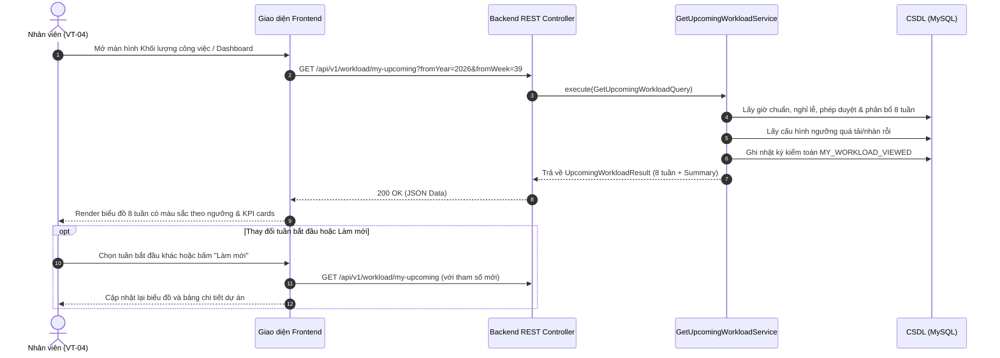

# Thiết Kế Giao Diện NCL-13-CN-004: Xem khối lượng công việc sắp tới của tôi

## 1. Tổng quan giao diện (UI Architecture)

Giao diện **Khối lượng công việc sắp tới (Upcoming Workload View)** phục vụ nhân viên trực tiếp quản lý năng lực và thời gian của bản thân.

Màn hình bao gồm 4 khối chính:
1. **Thanh điều hướng & Header**:
   - Tiêu đề "Khối lượng công việc 8 tuần tới".
   - Bộ chọn tuần bắt đầu (`Tuần hiện tại` hoặc chọn tuần tương lai).
   - Nút `Làm mới (Refresh)` tải lại dữ liệu tức thời.
   - Trạng thái các mức ngưỡng: Ngưỡng quá tải (> 100%), Ngưỡng nhàn rỗi (< 70%).
2. **Thẻ thống kê tổng quan (Summary KPI Cards)**:
   - Tổng giờ phân bổ (Total Allocated Hours).
   - Giờ khả dụng ròng (Net Available Hours).
   - Tỷ lệ tải trung bình 8 tuần (Average Utilization Rate).
   - Cảnh báo số tuần quá tải / nhàn rỗi.
3. **Biểu đồ cột trực quan 8 tuần (Interactive 8-Week Workload Chart)**:
   - 8 cột đại diện cho 8 tuần tiếp theo.
   - Chiều cao cột tương ứng với % tải năng lực (`Utilization %`).
   - Đường kẻ chỉ dẫn (Threshold Guidelines): Đường 100% (Quá tải) và Đường 70% (Nhàn rỗi).
   - Màu sắc theo trạng thái:
     - 🔴 **Đỏ / Rose**: Khi quá tải > 100% (Hiển thị badge `+X.Xh Quá tải`).
     - 🟢 **Xanh lục / Emerald**: Khi tải trong mức cân bằng 70% - 100%.
     - 🟡 **Vàng / Amber**: Khi tải thấp < 70% (Nhàn rỗi).
   - Click chọn tuần để xem chi tiết phân rã dự án.
4. **Bảng phân rã chi tiết dự án theo tuần (Project Allocation Breakdown)**:
   - Danh sách dự án trong tuần được chọn.
   - Tên dự án, mã dự án, vai trò chuyên môn đảm nhận.
   - Số giờ phân bổ, tỷ lệ % trên tổng giờ khả dụng.
   - Ghi chú phân bổ hoặc thông tin liên quan.

---

## 2. Luồng tương tác người dùng (User Interaction Flow)

---

## 3. Quy chuẩn phản hồi lỗi & Ngoại lệ

- **401 Unauthorized**: Khi phiên làm việc hết hạn $\rightarrow$ Tự động điều hướng về màn hình đăng nhập `/login`.
- **403 Forbidden**: Khi người dùng cố xem dữ liệu ngoài phạm vi cho phép $\rightarrow$ Hiển thị thông báo "Bạn không có quyền xem khối lượng công việc của nhân viên này" và ghi log kiểm toán.
- **404 Not Found**: Khi không tìm thấy hồ sơ nhân viên $\rightarrow$ Hiển thị thông báo "Không tìm thấy hồ sơ nhân sự của tài khoản hiện tại".
