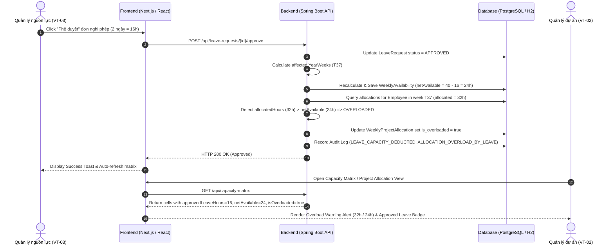

# Tài liệu Thiết kế Giao diện & Luồng xử lý: Trừ năng lực khả dụng khi nghỉ phép được duyệt

## 1. Tổng quan Thiết kế
Tài liệu mô tả thiết kế giao diện ma trận năng lực tuần, các thành phần hiển thị số giờ nghỉ phép đã được duyệt, cảnh báo quá tải phân bổ cho Quản lý dự án (PM), và màn hình/thông báo từ chối truy cập khi không đúng vai trò.

---

## 2. Bố cục Ma trận Năng lực Tuần (Weekly Capacity Matrix UI)

### 2.1. Ô Năng lực Tuần của Nhân sự (Capacity Matrix Cell)
Mỗi ô đại diện cho 1 nhân sự trong 1 tuần chứa các chỉ số:
- **Số giờ đã phân bổ (`Allocated Hours`)**: e.g., `32h`
- **Số giờ khả dụng ròng (`Net Available Hours`)**: e.g., `24h` (Đã trừ 16h nghỉ phép)
- **Huy hiệu/Badge Giờ nghỉ phép đã duyệt (`Approved Leave Badge`)**: 
  - Hiển thị nhãn: `🌴 -16h (2 ngày nghỉ phép)`
  - Tooltip khi hover: *"Đơn nghỉ phép #102 đã được duyệt từ 15/09 đến 16/09 (16h)"*
- **Trạng thái Quá tải (Overload Warning Indicator)**:
  - Nếu `Allocated Hours > Net Available Hours` (e.g., `32h > 24h`):
    - Ô tuần hiển thị viền đỏ và nền cam nhạt.
    - Cảnh báo badge: `⚠️ Quá tải +8h`
    - Chi tiết: *"Tuần T37: Phân bổ 32h / Khả dụng 24h. Vượt quá 8h do đơn nghỉ phép vừa được duyệt."*

### 2.2. Giao diện Cảnh báo Quá tải cho Quản lý Dự án (PM Overload Alert Banner)
Khi PM truy cập danh sách dự án hoặc bảng năng lực:
```text
+----------------------------------------------------------------------------------+
| ⚠️ CẢNH BÁO NĂNG LỰC DỰ ÁN                                                        |
| Nhân sự Nguyễn Văn A (ID: 105) trong Dự án ERP Implementation vừa được duyệt      |
| đơn xin nghỉ phép 2 ngày (16h) tại tuần T37 (15/09 - 21/09).                     |
| Tổng phân bổ: 32h | Giờ khả dụng mới: 24h => Quá tải: 8h.                        |
| [Xem chi tiết phân bổ]                          [Xác nhận / Điều chỉnh phân bổ]  |
+----------------------------------------------------------------------------------+
```

### 2.3. Màn hình / Thông báo Từ chối Truy cập (Access Denied View)
Khi người dùng không thuộc vai trò VT-03 (Quản lý nguồn lực), VT-02 (PM trong phạm vi), hoặc VT-01 cố gắng truy cập bảng năng lực:
```text
+----------------------------------------------------------------------------------+
| 🛑 TRUY CẬP BỊ TỪ CHỐI (403 FORBIDDEN)                                           |
| Bạn không có quyền xem bảng năng lực khả dụng theo tuần.                         |
| Lần cố gắng truy cập này đã được ghi nhận vào nhật ký hệ thống.                   |
| Mã lỗi: ERR_ACCESS_DENIED_CAPACITY_VIEW                                         |
| Thời điểm: 2026-09-12 21:45:00                                                  |
+----------------------------------------------------------------------------------+
```

---

## 3. Luồng Tương tác Hệ thống (Sequence Flow)



---

## 4. Hợp đồng API (API Contracts)

### GET `/api/capacity-matrix`
**Request Headers**: `Authorization: Bearer <token>`
**Response 200 OK**:
```json
{
  "orgUnitId": 2,
  "orgUnitName": "Phòng Phần mềm",
  "weekHeaders": [
    { "year": 2026, "weekNumber": 37, "formattedLabel": "T37 (15/09 - 21/09)" }
  ],
  "rows": [
    {
      "employeeId": 105,
      "employeeCode": "NV00105",
      "fullName": "Nguyễn Văn A",
      "cells": [
        {
          "year": 2026,
          "weekNumber": 37,
          "allocatedHours": 32.0,
          "availableHours": 24.0,
          "approvedLeaveHours": 16.0,
          "status": "OVERLOADED",
          "isOverloaded": true,
          "excessHours": 8.0
        }
      ]
    }
  ]
}
```
**Response 403 Forbidden** (Lỗi phân quyền & Logged):
```json
{
  "code": "PERMISSION_DENIED",
  "message": "Không có quyền xem ma trận năng lực khả dụng theo tuần.",
  "timestamp": "2026-09-12T21:45:00Z"
}
```
